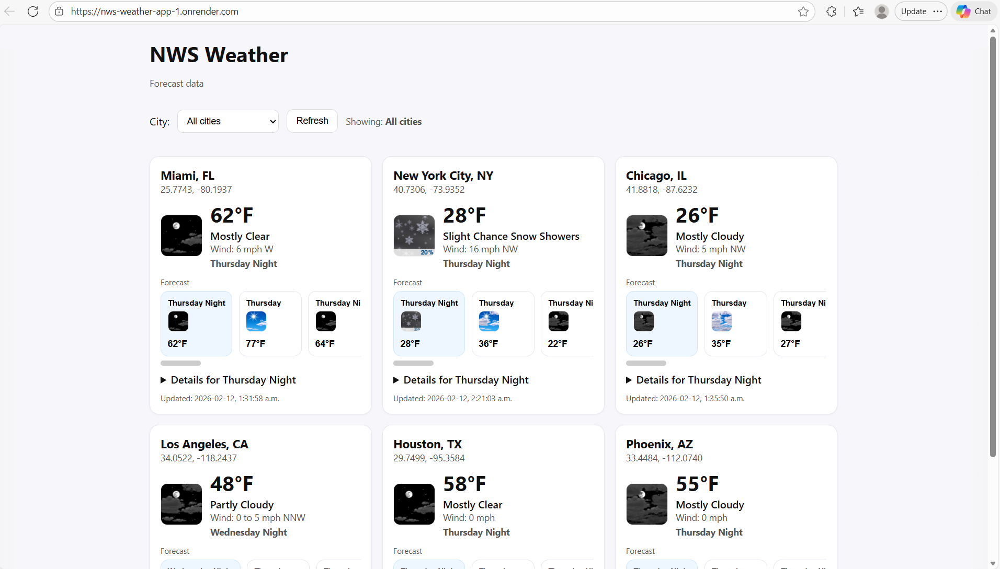
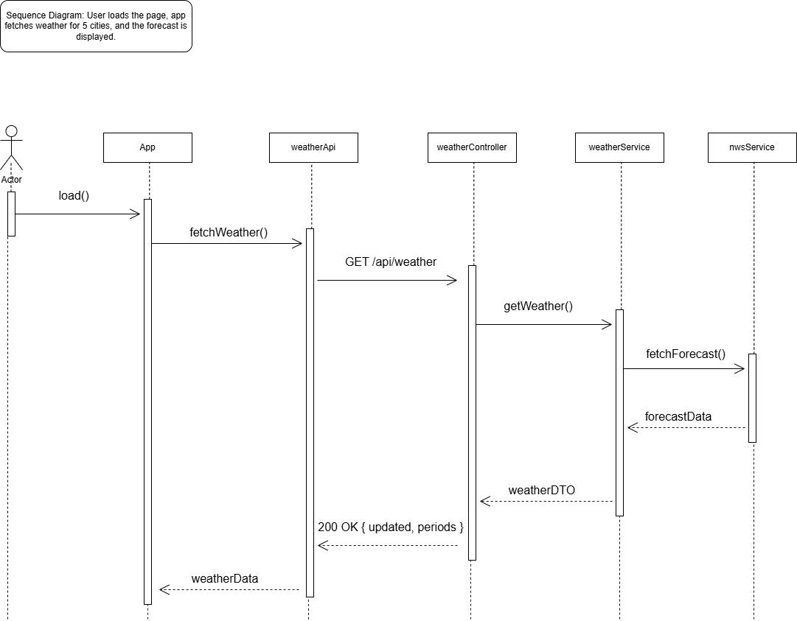

# NWS Weather Application 

## Live Demo

Please go to https://nws-weather-app-1.onrender.com/ to access the NWS Weather Application.




## Description
This project is a full-stack web application that displays weather forecast data using the
National Weather Service (NWS) API. 

The backend is built using Node.js and Express and is responsible for:

- Fetching forecast data from the NWS API
- Implementing caching to reduce API calls
- Handling errors, validation, and API responses in a structured format

The frontend is built using React and is responsible for:

- Showing weather cards for multiple cities
- Displaying the forecast for current and future dates
- Allowing users to filter by city
- Handling errors gracefully


## Tech Stack

- Backend: Node.js, Express
- Frontend: React, Vite
- External API: National Weather Service (NWS)
- Deployment: Render
  

## Architecture Overview

- The backend is structured as follows:
  - Routes: Define API endpoints
  - Controllers: Handle HTTP requests and return a response
  - Services: Contain business logic such as caching and fetching weather data
  - Repositories: Provide city configuration data
  - Utilities: In-memory cache implementation
 
- The frontend is structured as follows:
  - App.jsx: renders the application UI
  - CityWeatherCard.jsx: renders individual city cards with their current and future weather
  information
  - Reusable UI components: loading indicator and an error banner
  - weatherApi.js: fetches the weather information from the backend


## Sequence Diagram

The diagram below shows the interaction flow when a user loads the application and
weather data is retrieved from the backend and NWS API.




## Deployment

- The application is deployed as two separate services on Render:

  - Backend (Node.js and Express): Hosted as a Render Web Service.
  - Frontend (React and Vite): Hosted as a Render Static Site.

- Both services are deployed independently, allowing the frontend and backend to scale
and be updated separately.
- **Note**: The backend is hosted on the Render free tier. Due to cold-start behavior
on the free plan, the first request after a period of inactivity may take some time
to respond. Subsequent requests are significantly faster.

## Local Development

### Clone the Repository
```
git clone https://github.com/YashKapoor1102/NWS-Weather-App.git
cd NWS-Weather-App
```

### Backend Setup
1. Create a ".env" file in the backend folder.
2. Run:
   ```
   cd backend
   npm install
   npm run dev
   ```

### Frontend Setup
1. Create a .env file in the frontend folder.
2. Run:
   ```
   cd frontend
   npm install
   npm run dev
   ```
   

## Quality Assurance

### Testing

This project includes unit and integration tests for both the backend and frontend.

- Backend: Jest and Supertest
- Frontend: React Testing Library and Jest

Tests validate:
- API responses
- Service logic
- Component rendering
- Error Handling

### Continuous Integration

A GitHub Actions pipeline automatically:
  - Installs dependencies
  - Runs all tests
  - Fails the build if any test fails


## Future Improvements
- Replace the in-memory cache with Redis to support horizontal scaling and enhance
reliability in production.
- Add API rate limiting to better protect both the backend service and the external
NWS API.


## Credits

- Yash Kapoor
